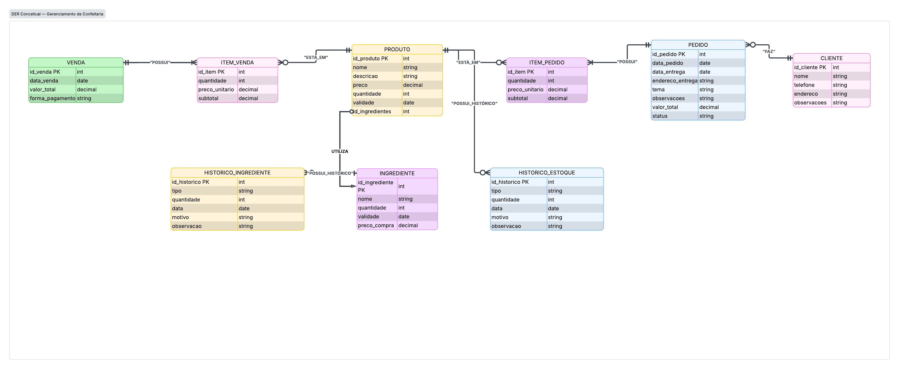

# Confeitaria-db
Projeto de banco de dados para auxiliar no gerenciamento de uma confeitaria.
# Entrega 1 — Modelo Conceitual (DER)
### Integrantes

- Gustavo Bento Gonçalves — RGM 42389401
- Nicolas Souza Costa — RGM 48204030
- Guilherme Correia Torres - RGM 48210731
- Charles Henrique da Silva Lima - RGM 48175145

**Curso:** Análise e Desenvolvimento de Sistemas

---

# 1. Caracterização da Organização

## Nome e natureza da organização

A organização escolhida pelo grupo é a **LuCakess**, uma confeitaria independente localizada na cidade de São Paulo, no bairro Vila Progresso, Zona Leste.

**Endereço:** Av. Monsenhor Agnelo, 817 - Vila Progresso, São Paulo - SP, 08240-670.

A LuCakess é uma organização com fins lucrativos que atua no segmento de confeitaria, trabalhando tanto com produtos de pronta-entrega quanto com pedidos e encomendas realizados previamente pelos clientes.

**CNPJ:** 

**Instagram:** [@lucakess2](https://www.instagram.com/lucakess2/)

**Contato:** (11) 98501-9958

## Contexto e porte

A LuCakess apresenta uma operação de pequeno porte, com uma equipe enxuta e atividades distribuídas entre atendimento, produção e entregas.

A operação conta aproximadamente com quatro pessoas diretamente envolvidas nas atividades, sendo uma delas responsável pelo atendimento/caixa, duas pela produção e uma pelas entregas. O proprietário também participa da operação da organização.

A confeitaria trabalha com produtos de pronta-entrega, como cookies e outros produtos disponibilizados para venda presencial, além de receber pedidos e encomendas de clientes. Também são realizadas entregas e retiradas no estabelecimento.

A aquisição de ingredientes e insumos ocorre periodicamente, aproximadamente a cada quinze dias, de acordo com a necessidade da operação.

## Problemas e necessidades identificados

Durante a pesquisa de campo, o grupo identificou que uma parcela significativa da operação da confeitaria é realizada por meio do **WhatsApp**, sem a utilização de um sistema centralizado para organização das informações.

Também foi identificado que o controle de estoque não é realizado de maneira estruturada. Dessa forma, existe dificuldade para acompanhar de maneira precisa as quantidades disponíveis de produtos e ingredientes e para manter um histórico organizado das movimentações.

Outro problema observado está relacionado aos produtos de pronta-entrega. Produtos como cookies ficam disponíveis para venda presencial, porém não existe atualmente um mecanismo estruturado para registrar cada venda realizada diretamente no estabelecimento e atualizar o controle dessas unidades.

Essas características podem dificultar a consulta de informações, o acompanhamento das vendas e pedidos e o controle da quantidade disponível em estoque.

## Justificativa da escolha

A LuCakess foi escolhida por ser uma organização real à qual o grupo possui acesso para realização de pesquisa de campo e por apresentar processos suficientemente diversificados para a aplicação dos conceitos de modelagem de dados.

A organização possui processos relacionados a clientes, pedidos, vendas, produtos, ingredientes e controle de estoque. Dessa forma, o cenário permite identificar diferentes entidades, atributos, relacionamentos e regras de negócio, além de possibilitar a evolução do modelo nas próximas etapas do projeto.

A escolha também permite abordar uma necessidade prática da organização: centralizar e organizar informações que atualmente são tratadas de forma predominantemente manual e por meio de diferentes canais, especialmente o WhatsApp.

## Evidências da organização

A existência da organização e o acesso do grupo para realização da pesquisa de campo são comprovados por meio de:

- Registro fotográfico realizado durante a visita presencial;
- Visita realizada em **09 de setembro de 2026**;
- Pesquisa realizada por meio de observação da operação;
- Conversa com o proprietário da organização;
- Informações públicas da organização em redes sociais e serviços de localização.

**Instagram:** [@lucakess2](https://www.instagram.com/lucakess2/)

**Google Maps:** https://maps.app.goo.gl/Zy8aPC7NhboGfnR7A

**Contato da organização:** (11) 98501-9958

---

# 2. Processos de Negócio

## Principais processos mapeados

A partir da pesquisa de campo, foram identificados os seguintes processos principais:

### Cadastro e atendimento de clientes

O cliente entra em contato com a confeitaria e fornece as informações necessárias para realização de um pedido. Os dados do cliente podem ser armazenados para facilitar pedidos futuros e o contato durante o atendimento.

### Registro de pedidos

Os pedidos são realizados principalmente por meio do WhatsApp. As informações referentes ao pedido, aos produtos desejados, às quantidades, à data de entrega ou retirada e às observações específicas são registradas para acompanhamento da encomenda.

Um pedido é considerado um registro independente da realização da entrega. Dessa forma, o sistema pode acompanhar o pedido mesmo quando a entrega ainda não ocorreu.

### Venda de produtos

As vendas podem ocorrer presencialmente no estabelecimento, principalmente para produtos de pronta-entrega.

O registro de venda permite armazenar a data da operação, a forma de pagamento e os produtos comercializados.

### Controle de produtos e estoque

Os produtos comercializados pela confeitaria possuem quantidade disponível para venda. O controle de estoque deve permitir registrar entradas, saídas, perdas e ajustes, mantendo também um histórico das movimentações.

Esse controle é especialmente importante para produtos de pronta-entrega, que podem ser vendidos presencialmente e atualmente não possuem um mecanismo estruturado para registrar essas saídas.

### Controle de ingredientes

A confeitaria também trabalha com ingredientes utilizados na produção dos produtos. O sistema deverá permitir o cadastro dos ingredientes, sua quantidade disponível, validade e preço de compra, além do registro de suas movimentações.

### Registro do histórico

As movimentações relacionadas a produtos e ingredientes devem ser armazenadas em entidades de histórico. Dessa maneira, além da quantidade atual, será possível manter informações sobre alterações anteriores, suas datas, quantidades, motivos e observações.

## Fluxogramas

Os fluxogramas dos principais processos serão anexados separadamente ao repositório, caso sejam utilizados pelo grupo.

---

# 3. Requisitos do Sistema

## 3.1 Requisitos Funcionais

| Código | Requisito |
|---|---|
| RF01 | O sistema deve permitir cadastrar clientes. |
| RF02 | O sistema deve permitir cadastrar produtos. |
| RF03 | O sistema deve permitir cadastrar ingredientes. |
| RF04 | O sistema deve permitir registrar vendas. |
| RF05 | O sistema deve permitir registrar pedidos. |
| RF06 | O sistema deve permitir adicionar produtos aos pedidos. |
| RF07 | O sistema deve permitir adicionar produtos às vendas. |
| RF08 | O sistema deve permitir controlar a quantidade disponível dos produtos. |
| RF09 | O sistema deve permitir controlar a quantidade disponível dos ingredientes. |
| RF10 | O sistema deve permitir registrar movimentações de estoque de produtos. |
| RF11 | O sistema deve permitir registrar movimentações de ingredientes. |
| RF12 | O sistema deve permitir consultar pedidos cadastrados. |
| RF13 | O sistema deve permitir consultar vendas realizadas. |
| RF14 | O sistema deve permitir consultar clientes cadastrados. |
| RF15 | O sistema deve permitir consultar produtos cadastrados. |
| RF16 | O sistema deve permitir consultar informações relacionadas à validade dos produtos e ingredientes. |
| RF17 | O sistema deve manter o histórico das movimentações de estoque. |
| RF18 | O sistema deve permitir registrar informações de entrega ou retirada relacionadas aos pedidos. |

## 3.2 Requisitos Não Funcionais

| Código | Requisito |
|---|---|
| RNF01 | O sistema deve possuir uma interface simples e intuitiva para facilitar sua utilização pelos funcionários da confeitaria. |
| RNF02 | O sistema deve utilizar mecanismos de autenticação para proteger o acesso às informações. |
| RNF03 | O sistema deve manter a integridade e consistência dos dados registrados. |
| RNF04 | As operações comuns de cadastro, consulta e registro devem apresentar tempo de resposta adequado à rotina da organização. |
| RNF05 | O sistema deve estar disponível durante o período de funcionamento da organização. |
| RNF06 | Os dados pessoais dos clientes devem ser tratados de maneira adequada e utilizados somente para as finalidades relacionadas às operações da confeitaria. |

---

# 4. Regras de Negócio

## Regras operacionais

**RN01.** Um cliente pode realizar vários pedidos ao longo do tempo.

**RN02.** Cada pedido deve estar associado a um cliente cadastrado.

**RN03.** Um pedido deve possuir pelo menos um produto.

**RN04.** Um pedido pode possuir vários produtos, e um mesmo produto pode aparecer em diferentes pedidos.

**RN05.** O pedido deve armazenar a quantidade e o preço praticado para cada produto no momento do pedido.

**RN06.** O pedido possui uma data de realização e pode possuir uma data prevista para entrega ou retirada.

**RN07.** O pedido deve possuir um status para permitir o acompanhamento de sua situação.

**RN08.** Vendas podem ser realizadas presencialmente para produtos de pronta-entrega.

**RN09.** Uma venda pode possuir vários produtos, e um produto pode participar de várias vendas.

**RN10.** Cada venda deve possuir data, valor total e forma de pagamento.

**RN11.** O preço registrado no item da venda representa o valor praticado no momento da operação, independentemente de alterações posteriores no preço atual do produto.

**RN12.** Produtos disponíveis para comercialização possuem uma quantidade controlada em estoque.

**RN13.** As movimentações de estoque devem possuir tipo, quantidade, data e motivo.

**RN14.** O histórico de estoque deve preservar as movimentações realizadas, mesmo após alterações posteriores na quantidade atual do produto.

**RN15.** Ingredientes devem possuir quantidade disponível, validade e preço de compra.

**RN16.** As movimentações dos ingredientes devem ser registradas em seu respectivo histórico.

**RN17.** Produtos e ingredientes sujeitos a controle de validade devem possuir uma data de validade registrada.

## Restrições organizacionais

A operação da confeitaria possui uma equipe reduzida e concentra diversas atividades em poucas pessoas. Por esse motivo, o sistema deve priorizar a organização das informações e a redução da dependência de controles manuais.

O uso predominante do WhatsApp para comunicação e registro dos pedidos também representa uma restrição operacional importante. O sistema proposto deve centralizar as informações relevantes dos pedidos, evitando que informações importantes dependam exclusivamente do histórico de conversas.

O controle de produtos de pronta-entrega também precisa ser considerado, pois esses produtos podem ser comercializados presencialmente e suas saídas devem refletir corretamente na quantidade disponível em estoque.

As informações dos clientes também devem ser tratadas de maneira adequada, evitando o armazenamento ou exposição desnecessária de dados pessoais.

---

# 5. Dicionário de Dados Conceitual (Preliminar)

O dicionário de dados será desenvolvido separadamente em **HTML**, conforme solicitado na entrega.

As entidades contempladas no modelo atual são:

- CLIENTE
- PEDIDO
- ITEM_PEDIDO
- PRODUTO
- ITEM_VENDA
- VENDA
- INGREDIENTE
- HISTORICO_INGREDIENTE
- HISTORICO_ESTOQUE

O documento HTML apresentará, para cada entidade, seus respectivos atributos, descrições e regras de negócio associadas.

---

# 6. Modelagem Conceitual

## Entidades reconhecidas

### CLIENTE

Representa as pessoas que realizam pedidos ou mantêm relacionamento comercial com a confeitaria.

**Principais atributos:**

- `id_cliente`
- `nome`
- `telefone`
- `endereco`
- `observacoes`

### PEDIDO

Representa uma solicitação ou encomenda realizada por um cliente, independentemente de sua entrega ou retirada já ter ocorrido.

**Principais atributos:**

- `id_pedido`
- `id_cliente`
- `data_pedido`
- `data_entrega`
- `endereco_entrega`
- `tema`
- `observacoes`
- `valor_total`
- `status`

### ITEM_PEDIDO

Representa cada produto incluído em um pedido.

**Principais atributos:**

- `id_item`
- `id_pedido`
- `id_produto`
- `quantidade`
- `preco_unitario`
- `subtotal`

A entidade funciona como associação entre PEDIDO e PRODUTO, permitindo que um pedido possua vários produtos e que um produto esteja presente em diversos pedidos.

### PRODUTO

Representa os produtos comercializados pela confeitaria, incluindo produtos de pronta-entrega.

**Principais atributos:**

- `id_produto`
- `nome`
- `descricao`
- `preco`
- `quantidade`
- `validade`

A quantidade representa o estoque disponível do produto.

### VENDA

Representa uma operação de venda realizada pela confeitaria.

**Principais atributos:**

- `id_venda`
- `data_venda`
- `valor_total`
- `forma_pagamento`

A entidade permite registrar vendas de produtos de pronta-entrega realizadas presencialmente.

### ITEM_VENDA

Representa os produtos que compõem uma venda.

**Principais atributos:**

- `id_item`
- `id_venda`
- `id_produto`
- `quantidade`
- `preco_unitario`
- `subtotal`

Assim como ITEM_PEDIDO, funciona como entidade associativa entre uma operação e os produtos envolvidos.

### INGREDIENTE

Representa os ingredientes utilizados pela confeitaria na produção dos produtos.

**Principais atributos:**

- `id_ingrediente`
- `nome`
- `quantidade`
- `validade`
- `preco_compra`

### HISTORICO_ESTOQUE

Representa as movimentações realizadas no estoque de produtos.

**Principais atributos:**

- `id_historico`
- `id_produto`
- `tipo`
- `quantidade`
- `data`
- `motivo`
- `observacao`

A entidade permite manter o histórico das alterações de estoque.

### HISTORICO_INGREDIENTE

Representa as movimentações relacionadas ao estoque de ingredientes.

**Principais atributos:**

- `id_historico`
- `id_ingrediente`
- `tipo`
- `quantidade`
- `data`
- `motivo`
- `observacao`

## Relacionamentos pertinentes

O modelo estabelece os seguintes relacionamentos principais:

- **CLIENTE realiza PEDIDO:** um cliente pode realizar vários pedidos, enquanto cada pedido está associado a um cliente.
- **PEDIDO possui ITEM_PEDIDO:** um pedido possui um ou mais itens.
- **ITEM_PEDIDO referencia PRODUTO:** cada item representa um produto incluído no pedido.
- **VENDA possui ITEM_VENDA:** uma venda pode conter vários itens.
- **ITEM_VENDA referencia PRODUTO:** cada item de venda está relacionado a um produto.
- **PRODUTO possui HISTORICO_ESTOQUE:** um produto pode possuir diversas movimentações registradas em seu histórico.
- **INGREDIENTE possui HISTORICO_INGREDIENTE:** um ingrediente pode possuir diversas movimentações registradas em seu histórico.

Os relacionamentos entre PEDIDO e PRODUTO e entre VENDA e PRODUTO são representados por entidades associativas, respectivamente ITEM_PEDIDO e ITEM_VENDA.

Essa estrutura permite armazenar informações específicas de cada ocorrência, como quantidade, preço unitário e subtotal.

## Restrições e políticas organizacionais aplicadas ao modelo

O modelo considera a diferença entre **PEDIDO** e **VENDA**.

O PEDIDO representa uma encomenda ou solicitação realizada pelo cliente e pode existir independentemente da conclusão da entrega.

Já a VENDA representa a comercialização registrada, sendo especialmente importante para as vendas presenciais de produtos de pronta-entrega.

O modelo também considera a necessidade de preservar o histórico das movimentações de estoque, evitando que somente a quantidade atual seja armazenada e que informações sobre alterações anteriores sejam perdidas.

---

# 7. Diagrama Entidade-Relacionamento (DER)

O Diagrama Entidade-Relacionamento desenvolvido pelo grupo está anexado ao repositório em formato de imagem.

O DER apresenta as entidades, seus atributos, relacionamentos e respectivas cardinalidades, contemplando os principais processos identificados durante a pesquisa de campo.

O modelo foi desenvolvido considerando a possibilidade de evolução do sistema nas próximas etapas do projeto, principalmente em relação ao controle de pedidos, vendas, produtos, ingredientes e estoque.

**Arquivo do DER:** 

# 8. Justificativa Técnica

A modelagem foi construída a partir dos processos observados na LuCakess durante a pesquisa de campo e busca representar os principais dados necessários para o gerenciamento das operações da organização.

A entidade **CLIENTE** foi definida para centralizar os dados dos consumidores que realizam pedidos. Sua separação em relação à entidade PEDIDO permite que um mesmo cliente possua diversos pedidos ao longo do tempo sem necessidade de duplicar suas informações.

A entidade **PEDIDO** representa as encomendas realizadas pelos clientes. Ela foi mantida separada de VENDA porque os dois conceitos possuem finalidades distintas dentro do processo observado.

O pedido representa uma solicitação que pode estar em diferentes etapas de atendimento, enquanto a venda representa uma operação de comercialização registrada.

Dessa forma, um pedido não depende necessariamente da realização da entrega para existir no sistema.

As entidades **ITEM_PEDIDO** e **ITEM_VENDA** foram utilizadas para representar os produtos associados às respectivas operações.

Essa decisão permite representar adequadamente as associações entre pedidos, vendas e produtos e armazenar informações específicas de cada ocorrência, como quantidade, preço unitário e subtotal.

O atributo `preco_unitario` foi mantido nas entidades ITEM_PEDIDO e ITEM_VENDA mesmo com a existência do atributo `preco` em PRODUTO.

A decisão permite preservar o preço praticado no momento da operação, evitando que uma alteração futura no preço atual do produto altere o histórico de pedidos ou vendas anteriores.

A entidade **PRODUTO** concentra as informações dos produtos comercializados e também mantém sua quantidade disponível.

Essa estrutura é importante para representar os produtos de pronta-entrega, que precisam ter suas unidades controladas conforme as vendas realizadas.

A entidade **HISTORICO_ESTOQUE** foi criada separadamente de PRODUTO para preservar as movimentações realizadas.

Enquanto PRODUTO representa o estado atual do estoque, HISTORICO_ESTOQUE permite registrar alterações anteriores, incluindo tipo, quantidade, data, motivo e observação.

De forma semelhante, **INGREDIENTE** representa os ingredientes disponíveis para utilização na produção, enquanto **HISTORICO_INGREDIENTE** permite preservar o histórico das movimentações desses itens.

A separação entre dados atuais e dados históricos permite maior rastreabilidade e fornece uma base mais adequada para futuras funcionalidades de consulta, controle de estoque e análise das operações.

As cardinalidades foram definidas de acordo com a forma como os processos da organização funcionam.

Um cliente pode realizar diversos pedidos, enquanto cada pedido pertence a um cliente.

Pedidos e vendas podem possuir diversos produtos, sendo os itens utilizados para representar essa associação e armazenar as informações específicas de cada produto dentro da operação.

Dessa maneira, o modelo procura equilibrar simplicidade e capacidade de expansão, mantendo separadas as principais responsabilidades de cada entidade e permitindo que novas funcionalidades sejam adicionadas nas próximas etapas do projeto.

---

# 9. Uso de Inteligência Artificial

> **Preencher posteriormente pelo grupo.**

Nesta seção deverá ser apresentada a documentação preparada pelo grupo sobre o uso de Inteligência Artificial no desenvolvimento do projeto.

A documentação deverá incluir:

- Ferramenta de Inteligência Artificial utilizada;
- Etapa do projeto em que a IA foi utilizada;
- Motivação para utilização da ferramenta;
- Prompts utilizados;
- Respostas recebidas;
- Fontes verificadas;
- Trechos rejeitados ou corrigidos;
- Justificativa das decisões tomadas pelo grupo;
- Reflexão crítica sobre o uso da Inteligência Artificial.
